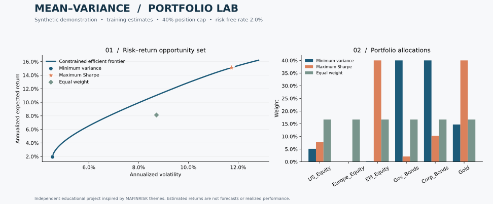

# portfolio-optimizer

**A reproducible Python research project connecting portfolio theory, numerical optimization, and risk management.**

[](https://github.com/talexkloen/portfolio-optimizer/actions/workflows/ci.yml)


I'm a quantitative finance student, and I built this project for my own practice.



## Research question

How do diversification and position limits change the risk–return trade-off, and how well do allocations based on historical estimates hold up on unseen observations?

This project builds minimum-variance and maximum-Sharpe portfolios, traces the constrained efficient frontier, and compares their allocations and held-out results with an equal-weight benchmark. The bundled example uses **fictional, correlated asset indices**, not historical market observations. It demonstrates the workflow without API credentials, vendor dependencies, or data-licensing ambiguity.

## What is implemented

- A typed Python package and command-line interface, with separate data, optimization, evaluation, and reporting modules.
- Fully invested, long-only portfolios; scalar or asset-specific lower/upper bounds; an optional expected-return floor.
- Minimum variance as a convex quadratic problem; positive-excess maximum Sharpe through a convex transformation rather than direct local ratio optimization.
- Arithmetic-return estimation and transparent diagonal covariance shrinkage.
- A chronological training/holdout split, equal-weight comparison, annualized return and volatility, Sharpe, CAGR, and maximum drawdown.
- Reproducible SVG/PNG figures, weights, frontier points, metrics, and run metadata.
- Tests against analytical solutions and a dense numerical search, data validation, failure cases, and a no-lookahead check. GitHub Actions runs lint, format, tests, the sample workflow, and a package build on Python 3.11–3.14.

## Run in five minutes

From the repository root, using Python 3.11 or later:

```bash
python -m venv .venv
source .venv/bin/activate         # Windows: .venv\Scripts\activate
python -m pip install -e '.[dev]'

# The sample CSV is already committed. Regenerate it deterministically if desired:
portfolio-optimizer sample --seed 42 --output data/sample_prices.csv

portfolio-optimizer analyze \
  --prices data/sample_prices.csv \
  --output reports \
  --max-weight 0.40 \
  --risk-free-rate 0.02 \
  --shrinkage 0.10 \
  --source-label "Synthetic demonstration"

pytest
ruff check .
ruff format --check .
```

Open `reports/efficient_frontier.svg` or `reports/efficient_frontier.png`. The `reports/` directory also contains:

| Output | Interpretation |
| --- | --- |
| `weights.csv` | Asset allocations for the three strategies |
| `training_metrics.csv` | Ex-ante moments estimated on the training segment |
| `holdout_metrics.csv` | Realized, gross-of-cost statistics on unseen observations |
| `frontier.csv` | Risk, return, Sharpe, and weights at each frontier point |
| `metadata.json` | Source label, dates, sample sizes, and model assumptions |

Rates and weights are decimals: `0.02` means 2%. Defaults assume daily observations and 252 periods per year. Use `--periods 12` for regularly sampled monthly data. The software does not infer observation frequency. Choose an annual arithmetic risk-free assumption consistent with the evaluation convention; the default is illustrative, not a current market quote.

## Python API and constraints

```python
import pandas as pd
from portfolio_optimizer import (
    PortfolioOptimizer,
    estimate_moments,
    load_prices,
    price_returns,
)

returns = price_returns(load_prices("data/sample_prices.csv"))
train = returns.iloc[:756]  # Estimate only on the training window.
mu, covariance = estimate_moments(train, periods=252, shrinkage=0.10)

lower = pd.Series(0.0, index=mu.index)
upper = pd.Series(0.40, index=mu.index)
lower["Gov_Bonds"] = 0.10
upper["EM_Equity"] = 0.20

model = PortfolioOptimizer(mu, covariance, risk_free_rate=0.02, lower=lower, upper=upper)
gmv = model.minimum_variance()
tangency = model.maximum_sharpe()
target = model.minimum_variance(target_return=0.06)
frontier = model.efficient_frontier(points=60)
print(tangency.weights)
print(tangency.expected_return, tangency.volatility, tangency.sharpe)
```

The return target is a **lower bound**, not an equality: a target below the global minimum-variance portfolio's return leaves that portfolio unchanged. The efficient frontier starts at that portfolio and moves to the maximum feasible expected return. Short selling, leverage, turnover, sector budgets, and cardinality constraints are not implemented.

## Methodology

For simple returns, `r[t] = P[t] / P[t-1] - 1`, estimate annual arithmetic moments:

\[
\mu = A\bar r, \qquad
\Sigma = A\left[(1-\alpha)S + \alpha\,\operatorname{diag}(S)\right],
\]

where `S` is the sample covariance (`ddof=1`), `A` is periods per year, and `α` is the chosen shrinkage intensity. This is fixed diagonal shrinkage, **not** an estimated Ledoit–Wolf intensity. Shrinkage reduces off-diagonal estimation noise; it does not remove uncertainty in expected returns. The square-root-of-time volatility convention assumes negligible serial covariance.

For weights `w`, annual portfolio return, volatility and Sharpe are:

\[
\mu_p=w^\top\mu,\quad \sigma_p=\sqrt{w^\top\Sigma w},\quad
SR_p=\frac{\mu_p-r_f}{\sigma_p}.
\]

Minimum variance solves:

\[
\min_w w^\top\Sigma w\quad
\text{s.t.}\quad \mathbf1^\top w=1,\;\ell\le w\le u,
\;\mu^\top w\ge\mu_{\text{target}}\;\text{(optional)}.
\]

Maximum Sharpe uses the positive-excess-return transformation described in [the mathematical notes](docs/methodology.md). Both problems use SciPy's SLSQP with analytical derivatives. A separate linear program establishes feasibility and the maximum attainable return. Solver status, weight sum, bounds and return targets are checked before any result is returned. Positive definiteness is required; singular covariance matrices produce an explicit error rather than silently changing the model.

## Sample data and holdout design

The committed `data/sample_prices.csv` contains 1,009 price observations for six fictional asset-class indices, generated with seed 42 using correlated Gaussian log increments. Business-day labels are synthetic and do not model exchange holidays. See [data provenance](data/README.md).

The first 756 returns estimate means and covariance; the final 252 returns evaluate the portfolios. Weights are estimated once and kept as **constant daily target weights** throughout the test period, which assumes daily rebalancing. There is no refitting on test observations. Test-period returns are aggregated before computing realized metrics; realized CAGR is distinct from annualized arithmetic return.

The evaluation excludes transaction costs, taxes, bid–ask spreads and market impact. It is a single holdout, not a walk-forward backtest. A research extension would add rolling estimation, turnover penalties, transaction costs, and comparisons across market regimes. Results from the synthetic example are not evidence of investment outperformance.

## Use your own data

Export adjusted total-return price indices, in a common currency and on aligned dates, to a CSV:

```csv
date,Asset_A,Asset_B,Asset_C
2024-01-02,100.0,100.0,100.0
2024-01-03,101.0,99.8,100.3
```

This snippet illustrates the schema; a real run needs at least three returns in **each** train/test segment. Supply enough observations for meaningful estimation. With three assets, a 40% cap is feasible; with two assets, use `--max-weight 0.60` or higher. Data must have positive prices, unique increasing dates, at least two assets, and no missing/infinite values. Nothing is silently sorted, filled, or dropped except the first undefined return. Align trading calendars explicitly and record any missing-data policy. Splits and dividends must be handled in the source data; currency movements matter for cross-market portfolios.

```bash
portfolio-optimizer analyze --prices my_adjusted_prices.csv --output reports/market \
  --source-label "Adjusted prices from YOUR_PROVIDER; downloaded YYYY-MM-DD"
```

The source label is user-provided metadata, not verified provenance. Do not commit proprietary datasets or credentials. No live-market downloader is required: the core analysis is reproducible offline after installation.

## Project structure

```text
src/portfolio_optimizer/       Data validation, optimization, evaluation, CLI and plots
tests/              Analytical, numerical, data and integration tests
examples/           Asset-specific constraint example
data/               Reproducible synthetic prices and provenance
docs/               Methodology, generated sample outputs and interview notes
.github/workflows/  Multi-version continuous integration
pyproject.toml      Package, dependency and tooling configuration
```

## Limitations and interpretation

Sample means are noisy, and small changes can substantially alter maximum-Sharpe allocations. Position limits regularize concentration but do not guarantee stability. Covariance shrinkage introduces bias as well as reducing estimation noise. The model considers variance rather than tail asymmetry or downside losses, and assumes frictionless continuous allocations. If no feasible portfolio has positive expected excess return, the maximum-Sharpe method deliberately raises an error; minimum variance remains available through the Python API.

This is an educational research tool, not investment advice or a production trading system.

## References

- Markowitz, H. (1952), *Portfolio Selection*, Journal of Finance, 7(1), 77–91. [DOI](https://doi.org/10.1111/j.1540-6261.1952.tb01525.x).
- Sharpe, W. F. (1966), *Mutual Fund Performance*, Journal of Business, 39(1), 119–138. [DOI](https://doi.org/10.1086/294846).
- [SciPy SLSQP documentation](https://docs.scipy.org/doc/scipy/reference/optimize.minimize-slsqp.html).

MIT licensed. Contributions should include a reproducible example and tests for any numerical behaviour change.
